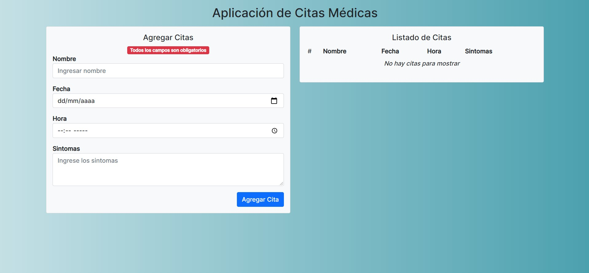

# Angular Citas Medicas

App que añade citas médicas a un listado de Citas implementado con Angular.

## Pasos

Ejecuta `ng serve` para servir la app de citas médicas. Navega a `http://localhost:4200/` en tu navegador para usar la app. 

## Preview

